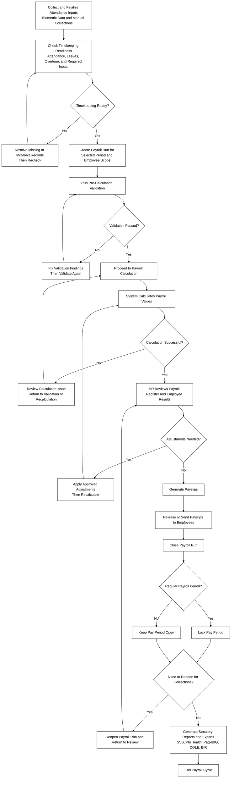
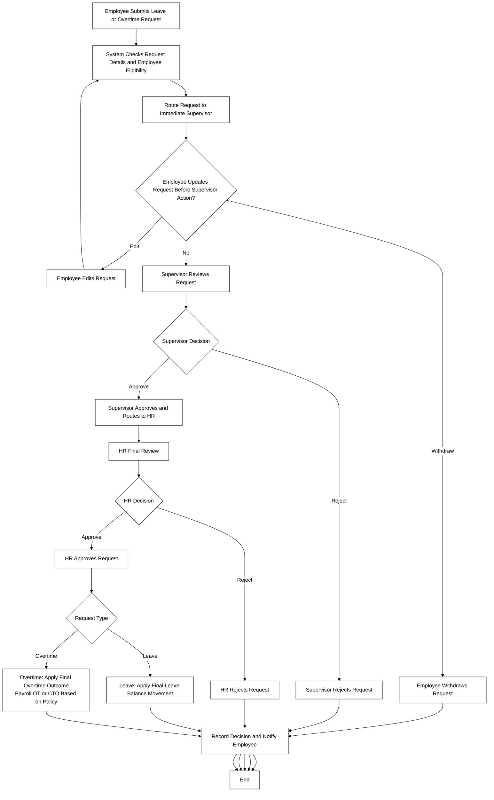

# Timekeeping, Payroll, Leave, and Overtime Process Flows

This document contains plain black-and-white Mermaid process flowcharts aligned with the current project behavior in `AGENTS.md` and `README.md`.

Swimlane variants are also available:

- `docs/flowcharts/timekeeping-payroll-swimlane-flow.mmd`
- `docs/flowcharts/leave-overtime-approval-swimlane-flow.mmd`

## 1) Timekeeping and Payroll Process

## 2) Leave and Overtime Submission and Approval Process

